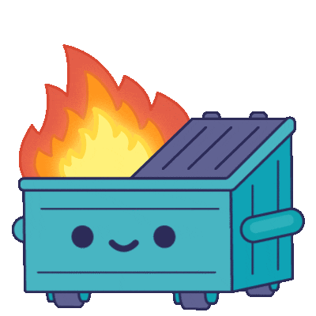

# Garbage-CAN



*Commanding MarCANex Nodes to throw Garbage at the CAN!*

## Software Stack

The front-end webpage was created using free bootstrap templates and code. The bootstrap is hosted on flask, which reads database information from a sqlite3 database file.

## Install

Install python and the necessary pip libraries.

```
pip install -r requirements.txt
```

Set the necessary flask environment variables and run flask to get Garbage-Can running on all interfaces on port 5000. If you want to only expose the webapp locally or to a certain interface, use `--host=127.0.0.1`.

```
export FLASK_APP=.
flask run --host=0.0.0.0
```

## Current Features

* Secure password authentication / sessions
* List known attacks
* Query list for certain values
    * search strings
    * filter values
* Add/Remove/Edit commands
* Interact with nodes

## Future Goals

* More robust node control
* Craft multi-command injects
* mass database adds with CSV
