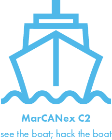

# MarCANex - NMEA 2000 Command and Control



The **Maritime CAN Bus Exploitation** Framework (MarCANex) is a lightweight command and control entity designed for hacking NMEA 2000 networks on maritime platforms. The MarCANex project includes attack execution software, a custom command and control implementation, and a web interface to launch and monitor attacks from.

## Organization

### [Garbage-CAN User Interface Software](Garbage-CAN/ReadMe.md)

- Originally designed for car hacking and refactored for C2, the Garbage-CAN is the web-based user interface used to manage nodes, launch attacks, and exfiltrate data.
- The Garbage-CAN server runs on python flask and SQLite.

### [C-2PO Command and Control / Exploitation Software](C-2PO/readme.md)

- Command and Control for Protocols Offshore (C-2PO) is the custom command and control software for the MarCANex framework.
- C-2PO includes beaconing functionality, diverse networking options, and end-to-end encryption.
- C-2PO client and server code utilizes multithreading to support multiple attacks at once.

## Usage

First clone the respository and export the `PYTHONPATH` and `FLASK_APP` variables.

```
git clone git@github.com:Jstith/MarCANex.git
export PYTHONPATH="${PYTHONPATH}:<INSTALLATION_DIRECTORY>/MarCANex/Garbage-CAN"
export FLASK_APP=<INSTALLATION_DIRECTORY>/MarCANex/Garbage-CAN
```

Then create a symetric key to encrypt beacon communications to and from the C2 server with.

```
python3
>>> from cryptography.fernet import Fernet
>>> key = Fernet.generate_key()
>>> print(key)
b'<BASE64_KEY>'
```

Take your key and place it inside of `<INSTALLATION_PATH>/MarCANex/C-2PO/hive/sym.key>`

```
echo '<BASE64_KEY>' > <INSTALLATION_PATH>/MarCANex/C-2PO/hive/sym.key
echo '<BASE64_KEY>' > <INSTALLATION_PATH>/MarCANex/C-2PO/beacon/sym.key
```

Then to start:

```
flask run
```

To host the flask application on all interfaces use:

```
flask run --host=0.0.0.0
```

The C2 framework will not start until a user succesfully logs.  Deafult credentials are:

```
ship-happens
Go Coast Guard!
```

To test incoming connections for a beacon you can run:

```
cd <INSTALLATION_PATH>/C-2PO/beacon
python3 beacon.py --ip <IP_HOSTING_FLASK>
```
At this point you should have able to view your beacon within the CLI or the GUI of the application and are ready to try the real thing!
