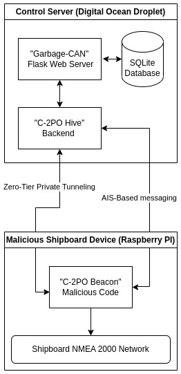

# MarCANex Documentation

This page is the head of the documentation tree. You can find links to the documentation for all things MarCANex here.

## Quick Links

### Garbage-CAN (Web-UI)

### C-2PO (Internet C2 Server)

- Beacon (client)
- Hive (server)

## Overview

**MarCANex** - The *Maritime CAN-Bus Exploitation Framework (MarCANex)* is a collection of tools designed to enable offensive security research on maritime vessels and NMEA 2000 networks. The MarCANex framework consists of the following tools:

**Garbage-CAN** - A Python Flask web application where operators can send and receive C2 traffic to infected hosts.

**C-2PO Hive** - The *Command and Control for Protocols Offshore (C-2PO)* backend C2 server that handles communication with C2 clients in the background. The Garbage-CAN webapp integrates natively with Hive, but Hive can also be run stand-alone from the command line.

**C-2PO Beacon** - The malicious code that runs on an infected device connected to a NMEA 2000 network that beacons back to the C-2PO Hive. This program was originally build to run on a Raspberry Pi 3 using a PICAN Hat, but hypothetically can run on any device connected to NMEA 2000 networks (currently linux reliant).

